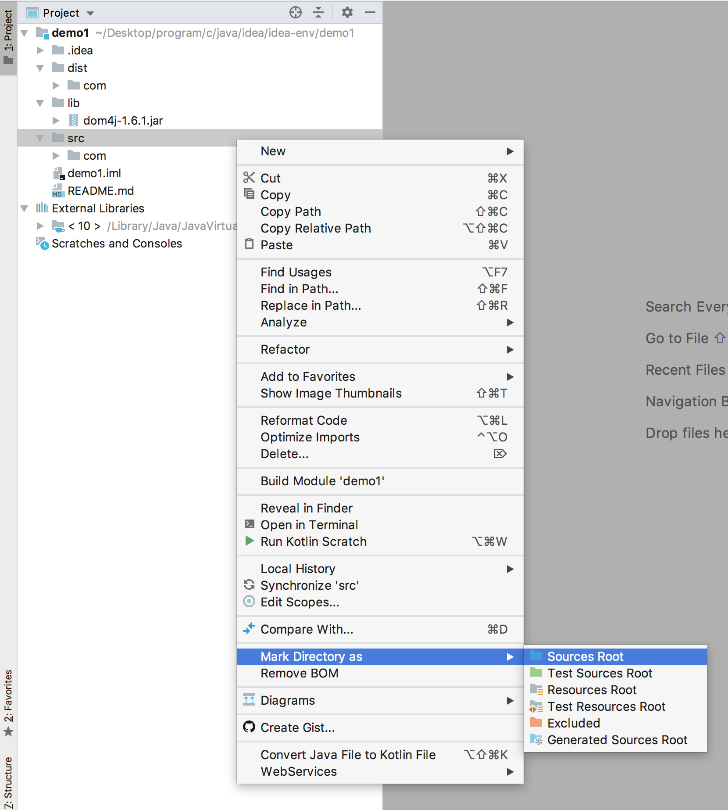
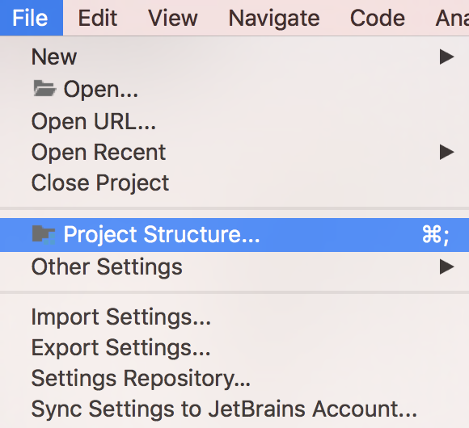
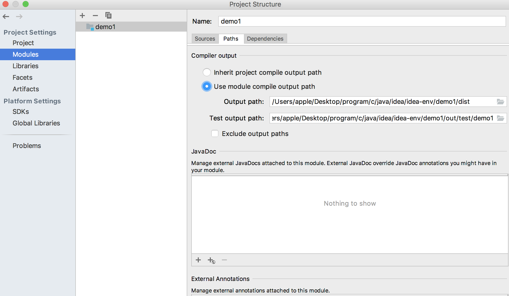
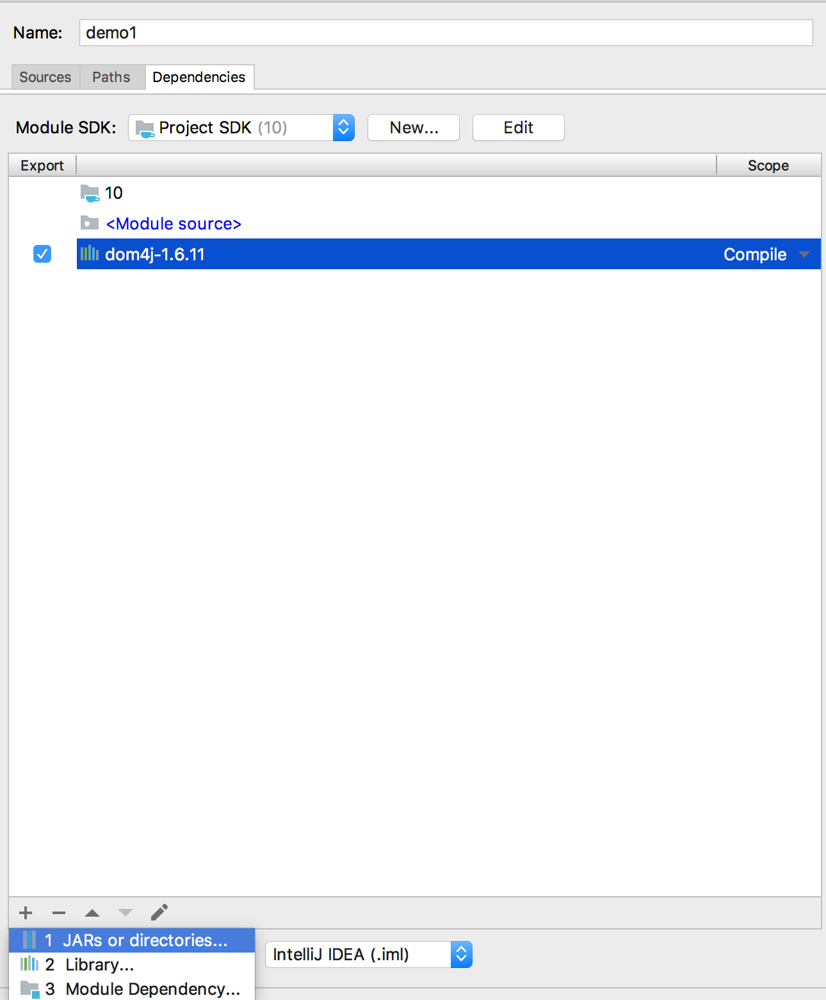

我们可能有下面的文件目录
- src: 存放源代码
- lib: 存放依赖的jar包
- dist: 存放编译后的class文件

我们可能会这样编译和运行
``` bash
$ javac -cp "lib/*:src" -d dist src/com/github/zhang89/Main.java

$ java -cp "lib/*:dist" com.github.zhang89.Main
```
可以看到，Java程序的编译和运行命令又臭又长，而且在编写代码的时候，文本编辑器因为不知道依赖的jar包位置，很难做智能补全。

而让我们在IDEA中打开demo1这个项目。

在我们之前的命令行程序参数中，虽然写的很多，但其实就是三个概念
- 源文件目录
- 依赖的jar包目录
- 输出文件目录

使用IDEA的话，我们就是通过配置上面的三个设置，达到
- 不用手动的在命令行敲代码
- 编写代码的时候自动读取依赖的jar包，帮我们做只能提醒

### 配置源文件目录
- 选中src目录，右键，mark directory as，Sources root 
  
  我们就可以将src目录标记为源文件目录

这样我们在点击开始按钮的时候IDEA就会把上述目录当做输入目录写到命令行参数中了。

### 配置输出目录


将里面的output改成你想要的目录

### 配置依赖的jar包

将你依赖的jar包添加到这里

然后我们就可以体验到编程的乐趣了